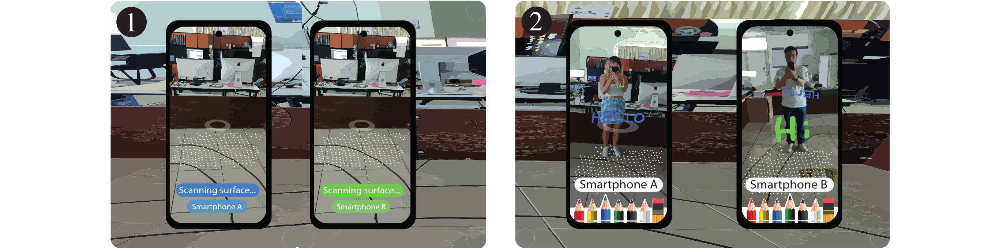

# CollabAR: A Framework for Collaborative Augmented Reality Applications | I3D 2025

<div style="text-align: center;">
  
  <p>Figure description: The result of the functionality test on a simple co-located collaborative AR drawing experience over two users' mobile devices using our framework. To establish collaboration, both devices start from the same initial reference point and perform an environmental scan, as illustrated in (1). After each device locally generates spatial anchors using ARCore, the spatial drawing functionality is enabled, as shown in (2).</p>
</div>

## Overview
This repository outlines the design, development, and implementation of a framework to simply the deployment and setup of co-located collaborative Augmented Reality (AR) experiences on mobile devices. It uses a centralized client-server architecture, with a single PC acting as a local server to handle data communication and synchronization across multiple mobile devices. This framework eliminates the reliance on cloud anchor services or third-party platforms that often come with restrictive limitations.

The project is organized into two main sections: the first covers the architecture and technical configuration of the local server (_Server folder_), describing the components and processes required to ensure its functionality; the second focuses on the design (_App folder_), evaluation, and validation of the application, identifying issues encountered during development, analyzing potential solutions, and proposing improvements for future iterations.

## Please kindly cite our paper as:
```
@article{,
  title    = {},
  author   = {},
  journal   = {},
  year      = {},
  address   = {},
  publisher = {},
  volume    = {},
  number    = {},
  url       = {},
  doi       = {},
  booktitle = {},
  series    = {}
}
```

## Dependencies
The following are the necessary requirements for the implementation and operation of the project. These are divided into two main categories: Server and Application.

### Server
See [SERVER.md](./Server/README.md) for instructions on how to setting up the Local Server from source and a list of supported platforms.
- **NodeJs**. It is used to facilitate server functions such as reading and sending messages.
- **Typescript**. Programming language selected to program the functionalities and operations of the server.
- **Mongoose**. Library for *Node.js* that facilitates the execution of queries to a MongoDB database.
- **Typegoose**. Library based on mongoose that facilitates the integration of its syntax using Typescript.
- **MongoDB**. NoSQL database system used to store the objects created in the mobile application.
- **JSON**. Object notation used for sending messages.
### App
See [APP.md](./App/README.md) for instructions on how to setting up the App from source and a list of supported platforms.
- **Unity**. Cross-platform game engine used to create the mobile app.
- **ARCore**. Platform used for building augmented reality experiences on Android devices.
- **.NET**. Platform used for message control between the server and the mobile application.


